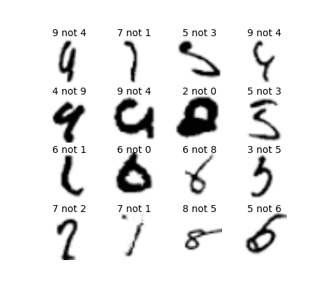

### MNIST 99.82

MNIST trainer written in PyTorch.  Please see the notebook [mnist.ipynb](mnist.ipynb) for details,
or [run it yourself](https://colab.research.google.com/github/ttdoucet/mnist/blob/master/mnist.ipynb).

Our statistically thorough result claims 99.82 percent accuracy on the
test set, but if we throw in all the nets we trained into one big
committee, we get 99.84 percent accuracy.  On the ten thousand test
images, these sixteen are the ones that are misclassified.

